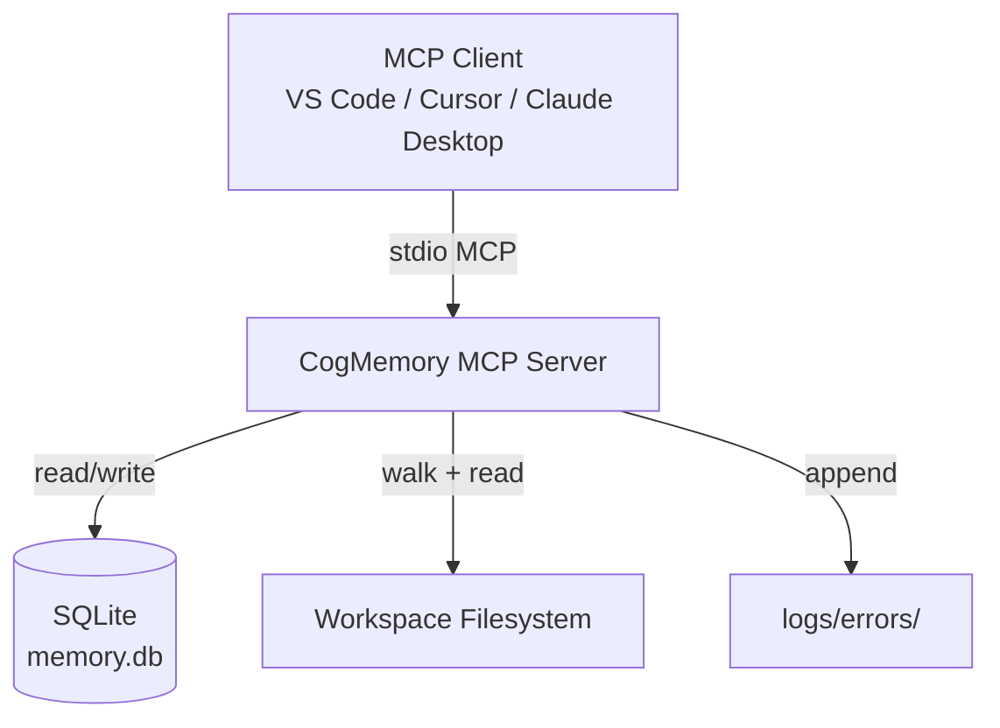
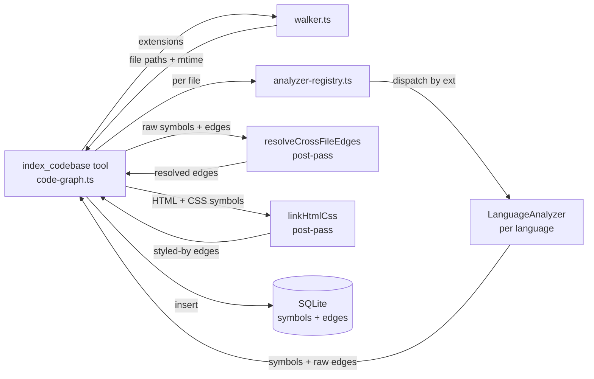

# System Architecture Blueprint: CogMemory MCP Multi-Language Analyzer

**TL;DR —** Extend `index_codebase` from JS/TS (ts-morph) + Python (tree-sitter) to ~25 languages by introducing a single `LanguageAnalyzer` interface, a per-extension registry, and a cross-file edge-resolution post-pass. No schema changes are required for any language — `symbols.symbol_type` and `edges.edge_type` are free-text columns. The existing `walker.ts`, `db/connection.ts`, and `migrate.ts` are untouched. Languages are added in the order specified in the plan (Phases A→W), each as an independent sprint once the Phase A refactor lands.

---

## 1. Software Requirements Specification (SRS)

### 1.1 Functional Targets

| ID   | Requirement                                                                                                                                                                                                                               | Acceptance Criteria                                                                                                                                                                                                        |
| ---- | ----------------------------------------------------------------------------------------------------------------------------------------------------------------------------------------------------------------------------------------- | -------------------------------------------------------------------------------------------------------------------------------------------------------------------------------------------------------------------------- |
| FR-1 | Introduce a `LanguageAnalyzer` interface that any language analyzer implements                                                                                                                                                            | Interface lives in `src/indexing/types.ts`; both existing analyzers conform; registry dispatches by extension                                                                                                              |
| FR-2 | Refactor existing `ts-analyzer.ts` and `py-analyzer.ts` to conform to the interface without changing their extracted output                                                                                                               | Smoke test passes unchanged; symbol/edge counts identical pre/post refactor on a fixture repo                                                                                                                              |
| FR-3 | Add analyzers for the 23 new languages listed in the plan (Java, C#, Erlang, Elixir, PHP, HTML, CSS, Go, Bash, Dockerfile, YAML, HCL, C, C++, Rust, Kotlin, Swift, Ruby, SQL, Scala, Lua + framework awareness for Phoenix/Laravel/Rails) | Each analyzer extracts symbols + edges for a sample file; registered in the registry; covered by a per-language smoke fixture                                                                                              |
| FR-4 | Cross-file edge resolution: resolve `calls`/`extends`/`implements`/`references` edges to symbols in _other_ files using a project-wide symbol index built during the indexing run                                                         | A call to a symbol defined in another file produces an edge whose `to_symbol_id` points at that file's symbol; unresolved edges are dropped (no dangling `to_symbol_id`)                                                   |
| FR-5 | Framework-aware symbol typing for Phoenix, Laravel, Rails                                                                                                                                                                                 | `symbolType` is refined (e.g. `laravel_controller`) when framework conventions are detected; no new tables or edge types                                                                                                   |
| FR-6 | HTML/CSS cross-grammar `styled-by` linkage                                                                                                                                                                                                | After both HTML and CSS symbols exist for a project, HTML class/id usage is matched to CSS selector definitions and recorded as `styled-by` edges                                                                          |
| FR-7 | Parse-failure and unsupported-file handling                                                                                                                                                                                               | Unreadable files are skipped; parse errors (partial tree-sitter trees with `ERROR` nodes) are logged to `logs/errors` with a stable signature and indexing continues; `ERROR`/`MISSING` nodes are skipped during traversal |
| FR-8 | Documentation & polish                                                                                                                                                                                                                    | README "Supported Languages" table updated; `index_codebase` tool description/schema updated; CONTRIBUTING note describes the `LanguageAnalyzer` interface; full multi-language smoke fixture passes                       |

### 1.2 Non-Functional Performance SLAs

| ID    | Constraint                                                        | Target                                                                                                                                 |
| ----- | ----------------------------------------------------------------- | -------------------------------------------------------------------------------------------------------------------------------------- |
| NFR-1 | Indexing latency on a mid-size repo (≤10k files, mixed languages) | ≤ 30s wall-clock for a full re-index on a 2024-era laptop; incremental re-index of ≤100 changed files ≤ 5s                             |
| NFR-2 | Memory ceiling during a full index                                | ≤ 1.5 GB RSS (tree-sitter trees are released per-file; the project-wide symbol index is the only large structure)                      |
| NFR-3 | Parse cost                                                        | Each file is parsed **exactly once** per `index_codebase` run (single `analyze()` method returns both symbols and edges from one tree) |
| NFR-4 | Schema stability                                                  | Zero migrations required for any of the 25 languages; `symbol_type`/`edge_type` remain free-text                                       |
| NFR-5 | Backward compatibility                                            | Existing JS/TS + Python indexing output is byte-identical after the Phase A refactor (verified by smoke test)                          |
| NFR-6 | Dependency footprint                                              | Each `tree-sitter-<lang>` package is installed lazily per phase; no single mega-package unless the count grows unwieldy                |

---

## 2. Architecture Decision Records (ADRs)

### ADR-1: Single `analyze()` method instead of `extractSymbols` + `extractEdges`

**Context.** The draft plan proposes two methods (`extractSymbols`, `extractEdges`), which forces every analyzer to parse the file twice or maintain an internal parse cache. The existing `py-analyzer.ts` already threads a `WalkCtx` through one tree walk that produces both symbols and edges simultaneously.

**Selected Approach.** The `LanguageAnalyzer` interface exposes a single method:

```typescript
analyze(filePath: string, content: string): { symbols: ExtractedSymbol[]; edges: ExtractedEdge[] };
```

This matches the existing Python analyzer's internal structure, guarantees one parse per file (NFR-3), and is simpler to implement for every new language.

**Consequences.**

- The draft's `extractSymbols`/`extractEdges` split is collapsed into one method.
- Analyzers that _want_ to separate the two passes internally still can (e.g. ts-morph's `analyzeFiles` already does two passes over the `SourceFile`); the interface just doesn't force it.
- The `AnalysisResult` shape (`{ symbols, edges }`) is preserved unchanged.

### ADR-2: Cross-file edge resolution as a post-pass in `code-graph.ts`

**Context.** The existing JS/TS analyzer only resolves `imports` edges cross-file (via `resolveImportPath`); `calls`/`extends` stay intra-file. The user has chosen to add a project-wide cross-file resolution pass so a call to a symbol defined in another file produces a real cross-file edge.

**Selected Approach.** A new `resolveCrossFileEdges` step runs in `code-graph.ts` **after** all analyzers have produced their raw `{ symbols, edges }` output but **before** edges are inserted into the DB:

1. Build a project-wide `symbolIndex: Map<string, Symbol>` keyed by `symbol_name` (with file-path tie-breaking — see ADR-3).
2. For each raw edge whose `to_file` is empty or whose `to_name` is unresolved, look up `to_name` in the project-wide index.
3. If found, set `to_file`/`to_start_line` to the resolved symbol's location.
4. If not found, **drop the edge** (no dangling `to_symbol_id` — the `edges` table has `NOT NULL` FKs on both ends).
5. Intra-file edges (where the analyzer already set `to_file` to the same file) are kept as-is.

This keeps the `LanguageAnalyzer` interface pure (no project-wide state leaks into per-file analyzers) and centralizes resolution policy in one place.

**Consequences.**

- Analyzers emit _unresolved_ edges by default (just `to_name`, no `to_file`) for cross-file calls; the post-pass resolves them.
- Analyzers _may_ set `to_file` when they can resolve it locally (e.g. Java `import` statements name the target class, which maps to a file by convention).
- Name collisions across files are resolved by the tie-break policy in ADR-3.

### ADR-3: Symbol-name collision tie-breaking

**Context.** A project-wide symbol index keyed by `symbol_name` will have collisions (two files each defining `class User`, two files each defining `def main`). The `edges` table requires both endpoints to resolve to a real `symbol_id`.

**Selected Approach.** Resolution order for an unresolved `to_name`:

1. **Same-file first** — if a symbol with that name exists in the _from_ file, use it (intra-file call).
2. **Imported-file next** — if the from-file has an `imports` edge to a file that defines the symbol, use that target.
3. **Same-package/namespace** — for languages with package qualifiers (Java, C#, PHP namespaces, Elixir modules), prefer the symbol in the same package.
4. **Unique globally** — if exactly one symbol with that name exists across the project, use it.
5. **Ambiguous** — if multiple candidates remain, drop the edge and log a debug note. Do not pick arbitrarily.

This is a heuristic, not type-accurate resolution. It is documented as a known limitation (NFR-5 scope: structural, not semantic).

**Consequences.**

- Some cross-file call edges will be dropped when names collide. This is acceptable for a structural code graph; the `codemap` BFS still works because most real call graphs have enough resolved edges to be useful.
- The policy is centralized in `resolveCrossFileEdges`, so it can be tuned without touching analyzers.

### ADR-4: Parse-tree caching is implicit (one `analyze()` call = one parse)

**Context.** The draft notes parsing twice is wasteful and suggests caching the tree per file. ADR-1 makes this moot — there is only one `analyze()` call per file, so there is only one parse.

**Selected Approach.** No explicit cache. Each analyzer's `analyze()` parses once, walks once, returns both symbols and edges. If a future analyzer needs the tree twice (unlikely), it can hold the tree in a local variable inside `analyze()`.

**Consequences.** Simpler interface, no cache invalidation logic, no memory pressure from held trees across files.

### ADR-5: Error handling — log to `logs/errors`, continue

**Context.** The draft says "skip the file (or log to `logs/errors`)". The existing analyzers silently `continue` on read errors. Parse errors (syntax errors in source) are a separate case — tree-sitter recovers and returns a partial tree with `ERROR`/`MISSING` nodes.

**Selected Approach.**

- **Read errors** (file unreadable, encoding issues): log a one-line entry to `logs/errors/` with signature `indexer:read:<ext>` and the file path; continue.
- **Parse errors** (tree-sitter returns a tree with `ERROR` nodes): log to `logs/errors/` with signature `indexer:parse:<lang>`; **still extract symbols/edges from the valid nodes** (tree-sitter's error recovery is good); skip `ERROR`/`MISSING` nodes during traversal.
- **Analyzer exceptions** (unexpected throw): log to `logs/errors/` with signature `indexer:throw:<lang>` and the stack; continue to the next file. Never crash the whole index run.

This is consistent with the existing `logs/errors/` pattern referenced in the draft.

**Consequences.**

- The `errors` subsystem gains indexer-originated entries. These are distinguishable by signature prefix `indexer:`.
- Partial trees from malformed files still contribute their valid symbols — better coverage than skipping outright.

### ADR-6: HTML/CSS `styled-by` as a post-pass in Phase G

**Context.** The `styled-by` edge links HTML class/id usage to CSS selector definitions — a cross-grammar join that cannot be done by either analyzer alone (the HTML analyzer doesn't know about CSS symbols; vice versa).

**Selected Approach.** A `linkHtmlCss` post-pass runs in `code-graph.ts` after both HTML and CSS analyzers have produced their symbols:

1. Collect all CSS symbols of type `css-class` / `css-id` into a map keyed by selector name.
2. For each HTML symbol of type `element`, extract the class/id attributes from the element (stored during HTML analysis).
3. For each class/id in the HTML element, look it up in the CSS map; if found, emit a `styled-by` edge from the HTML element symbol to the CSS selector symbol.

This mirrors the cross-file resolution post-pass (ADR-2) in shape — a project-wide join after per-file analysis.

**Consequences.**

- HTML analyzer must store class/id attributes on the element symbol (either in `symbol_name` as a composite, or via a side channel). The cleanest option: emit one `element` symbol per HTML element that has an `id` or is a custom element, and store class lists as a separate in-memory structure passed back alongside `AnalysisResult` (see Open Question OQ-1).
- SCSS `@extend` is out of scope for Phase G (the draft marks it "if supporting SCSS later").

### ADR-7: Framework awareness is a symbol-type refinement, not a new construct

**Context.** Phoenix, Laravel, Rails don't get separate analyzers — they're detected inside the base language analyzer's `analyze()` and the `symbolType` is refined.

**Selected Approach.** Each framework-aware analyzer has a small `refineSymbolType(filePath, symbolName, baseType, sourceHints)` helper that checks:

- File path patterns (`lib/*_web/controllers/`, `app/Http/Controllers/`, `app/controllers/`)
- Base-class / use-directive names (`extends Controller`, `use Phoenix.Controller`, `< ApplicationController`)

and overrides `symbolType` from generic (`module`/`class`) to specific (`phoenix_controller`/`laravel_controller`/`rails_controller`).

**Consequences.**

- No new tables, no new edge types (confirmed by the free-text `symbol_type` column).
- `generate_codemap` and `codemap_annotations` work unchanged — they already handle any `symbol_type` string.
- The refinement is opt-in per analyzer; languages without framework detection skip it.

### ADR-8: Dependency installation is per-phase, lazy

**Context.** Installing all ~23 `tree-sitter-<lang>` packages upfront bloats `package.json` and `node_modules` for languages that may never be used against a given client project.

**Selected Approach.** Each phase's first task is `pnpm add tree-sitter-<lang>`. The package is added to `dependencies` only when that phase is implemented. The registry import is added in the same commit.

**Consequences.**

- `package.json` grows incrementally.
- A user who only needs Java + Python never pays the install cost for Erlang/Lua/etc.
- The `tree-sitter-language-pack` mega-package remains a future swap if the per-language list grows unwieldy (draft §8).

### ADR-9: Walker extension handling — no change to `walker.ts`

**Context.** `walker.ts` filters by a caller-provided `extensions` array. The draft says "No changes needed to `walker.ts`".

**Selected Approach.** `code-graph.ts` builds the `extensions` list from `supportedExtensions()` (the union of all registered analyzers' `extensions`). The user can still override via the `extensions` tool param. `walker.ts` is untouched.

**Consequences.**

- `DEFAULT_EXTENSIONS` in `code-graph.ts` is replaced by a call to `supportedExtensions()`.
- Files with extensions no analyzer handles are skipped by the walker (they never reach an analyzer).
- One nuance: `walker.ts` matches by extension suffix (`.ext`). Dockerfile has no extension — see Open Question OQ-2.

---

## 3. System Modeling & Data Boundaries (C4 Context Model)

### 3.1 C4 Level 1 — System Context



### 3.2 C4 Level 2 — Container: Indexing Pipeline



### 3.3 Data Flow Boundaries

| Boundary                                    | Crossing Data                               | Format                           |
| ------------------------------------------- | ------------------------------------------- | -------------------------------- |
| `walker.ts` → `code-graph.ts`               | File paths + mtimes                         | `string[]` / `{ path, mtime }[]` |
| `code-graph.ts` → `analyzer-registry.ts`    | File extension                              | `string`                         |
| `analyzer-registry.ts` → `LanguageAnalyzer` | File path + content                         | `string`, `string`               |
| `LanguageAnalyzer` → `code-graph.ts`        | Symbols + raw (possibly unresolved) edges   | `AnalysisResult`                 |
| `resolveCrossFileEdges`                     | Project-wide `symbolIndex` + raw edges      | resolved `ExtractedEdge[]`       |
| `linkHtmlCss`                               | HTML element symbols + CSS selector symbols | `styled-by` `ExtractedEdge[]`    |
| `code-graph.ts` → SQLite                    | Inserted symbols + edges                    | SQL via prepared statements      |

### 3.4 API Contract: `LanguageAnalyzer` Interface

```typescript
// src/indexing/types.ts

export interface ExtractedSymbol {
  file_path: string; // relative to rootDir
  symbol_name: string; // e.g. 'Greeter.__init__' or 'UserController'
  symbol_type: string; // 'function' | 'class' | 'method' | 'phoenix_controller' | ...
  start_line: number | null;
  end_line: number | null;
}

export interface ExtractedEdge {
  from_file: string;
  from_name: string; // enclosing symbol name, or file_path if top-level
  from_start_line: number | null;
  to_file: string | null; // null = unresolved; resolveCrossFileEdges fills this
  to_name: string;
  to_start_line: number | null;
  edge_type: string; // 'calls' | 'imports' | 'extends' | 'implements' | 'includes' | 'styled-by' | 'references' | 'depends_on' | ...
}

export interface AnalysisResult {
  symbols: ExtractedSymbol[];
  edges: ExtractedEdge[];
}

export interface LanguageAnalyzer {
  /** File extensions this analyzer handles, without the dot. Lowercase. */
  extensions: string[];
  /** Human-readable name for logging/errors. */
  name: string;
  /** Parse one file's content and return its symbols + raw edges in one pass. */
  analyze(filePath: string, content: string): AnalysisResult;
}
```

### 3.5 Registry Contract

```typescript
// src/indexing/analyzer-registry.ts

export function getAnalyzerForExtension(
  ext: string,
): LanguageAnalyzer | undefined;
export function supportedExtensions(): string[];
export function getAnalyzerForFile(
  filePath: string,
): LanguageAnalyzer | undefined; // handles extensionless files like Dockerfile
```

---

## 4. Infrastructure, Observability & Resilience Blueprint

### 4.1 Observability

| Signal              | Source                            | Destination                  | Notes                                                                                                    |
| ------------------- | --------------------------------- | ---------------------------- | -------------------------------------------------------------------------------------------------------- | ----- | --------------------------------- |
| Index run summary   | `index_codebase` return value     | MCP tool response (JSON)     | `files`, `analyzed`, `deleted`, `newSymbols`, `newEdges`, `totalSymbols`, `totalEdges` — already present |
| Per-language counts | New: aggregate by analyzer `name` | MCP tool response            | Add `byLanguage: { java: {symbols, edges}, ... }` to the response for debuggability                      |
| Parse/read errors   | Analyzer try/catch                | `logs/errors/` files         | Signature `indexer:<read                                                                                 | parse | throw>:<lang>`; one line per file |
| Unresolved edges    | `resolveCrossFileEdges`           | `logs/errors/` (debug level) | Signature `indexer:unresolved:<edge_type>`; counts only, not per-edge (volume)                           |

### 4.2 Resilience & Failover

| Failure Mode                   | Detection                                   | Recovery                                                                                                                       |
| ------------------------------ | ------------------------------------------- | ------------------------------------------------------------------------------------------------------------------------------ |
| File unreadable                | `readFileSync` throws                       | Log to `logs/errors`, skip file, continue                                                                                      |
| Parse error (syntax)           | tree-sitter returns tree with `ERROR` nodes | Log, extract from valid nodes, skip `ERROR`/`MISSING` subtrees, continue                                                       |
| Analyzer throws unexpectedly   | try/catch around `analyzer.analyze()`       | Log stack to `logs/errors`, skip file, continue                                                                                |
| Unresolved edge endpoint       | `resolveCrossFileEdges` finds no candidate  | Drop edge (do not insert), optionally log count                                                                                |
| Symbol-name collision          | Multiple candidates after tie-break         | Drop edge, log count                                                                                                           |
| DB insert fails (FK violation) | `insertEdge.run` throws                     | Already caught per-edge in existing code (silent skip)                                                                         |
| OOM during large index         | Process killed                              | Mitigation: release tree-sitter trees per file (don't accumulate); symbol index is the only large structure, sized ~O(symbols) |

### 4.3 Performance Controls

| Control                    | Default                        | Tunable via                                                    |
| -------------------------- | ------------------------------ | -------------------------------------------------------------- |
| `maxDepth` in walker       | 20                             | `walkFilesWithMtime` options (not exposed to tool — could add) |
| `max_nodes` in codemap BFS | 50                             | `generate_codemap` tool param                                  |
| `max_hops` in codemap BFS  | 3                              | `generate_codemap` tool param                                  |
| Batch insert size          | One transaction per file batch | Hardcoded in `analyzeAndInsert` — could chunk if very large    |

---

## 5. Implementation Task List (Sprint Breakdown)

Legend: `- [ ] Not Started` | `- [/] In Progress` | `- [x] Completed` | `- [-] Blocked/Cancelled`

### Sprint 0: Pre-Flight — Edge Case Resolution & Fixtures

- [ ] Task 0.1: Decide Dockerfile/extensionless-file handling (OQ-2): add a `getAnalyzerForFile(filePath)` path-based fallback in the registry, and extend `walker.ts` to accept a `filenames` option (e.g. `['Dockerfile', 'Makefile']`) alongside `extensions`. Document the contract.
- [ ] Task 0.2: Create a `scripts/fixtures/` directory with one representative file per target language (small, real-world-shaped samples). These are the per-phase smoke-test inputs.
- [ ] Task 0.3: Add a `scripts/multi-lang-smoke.ts` harness that runs every registered analyzer against its fixture and asserts minimum symbol/edge counts. This grows one block per phase.
- [ ] Task 0.4: Snapshot the _current_ JS/TS + Python smoke-test output (symbol + edge counts on a fixture repo) as the regression baseline for Phase A.

### Sprint 1 (Phase A): Core Foundation — Interface, Registry, Refactor

- [ ] Task 1.1: Create `src/indexing/types.ts` with `LanguageAnalyzer`, `ExtractedSymbol`, `ExtractedEdge`, `AnalysisResult` (interface in §3.4). Move the shared types out of `ts-analyzer.ts`.
- [ ] Task 1.2: Refactor `ts-analyzer.ts` to export `tsAnalyzer: LanguageAnalyzer` with a single `analyze(filePath, content)` method. Preserve the existing `analyzeFiles` batch entrypoint as a thin wrapper that reads files and calls `analyze` per file (keeps `code-graph.ts` working during the transition).
- [ ] Task 1.3: Refactor `py-analyzer.ts` the same way: export `pythonAnalyzer: LanguageAnalyzer` with `analyze(filePath, content)`. The existing `analyzePythonFiles` becomes a thin wrapper.
- [ ] Task 1.4: Create `src/indexing/analyzer-registry.ts` with `register`, `getAnalyzerForExtension`, `supportedExtensions`, `getAnalyzerForFile`. Register `tsAnalyzer` and `pythonAnalyzer`.
- [ ] Task 1.5: Refactor `code-graph.ts`: replace `analyzeMixed` with a loop that dispatches each file to `getAnalyzerForExtension(ext).analyze(...)`. Replace `DEFAULT_EXTENSIONS` with `supportedExtensions()`. Keep the rest of the insert/resolve logic unchanged for this sprint.
- [ ] Task 1.6: Regression test — run `pnpm smoke-test` and the new multi-lang harness (JS/TS + Python blocks only). Confirm symbol/edge counts match the Task 0.4 snapshot exactly.
- [ ] Task 1.7: Add the cross-file edge resolution post-pass `resolveCrossFileEdges` to `code-graph.ts` (ADR-2 + ADR-3). Wire it between analyzer output and DB insert. Add the unresolved-edge count to the tool response as `unresolvedEdges`.

### Sprint 2 (Phase B): Java

- [ ] Task 2.1: `pnpm add tree-sitter-java`
- [ ] Task 2.2: Write `src/indexing/java-analyzer.ts`. Symbols: `class_declaration`, `interface_declaration`, `method_declaration`, `enum_declaration`, `record_declaration` (Java 14+). Methods are qualified as `ClassName.methodName`.
- [ ] Task 2.3: Edges: `method_invocation` → `calls` (unresolved `to_file`); `import_declaration` → `imports` (resolve `to_file` by mapping `com.foo.Bar` → `com/foo/Bar.java` heuristic); `superclass`/`super_interfaces` → `extends`/`implements`.
- [ ] Task 2.4: Register in `analyzer-registry.ts`. Add `java` block to `multi-lang-smoke.ts`.
- [ ] Task 2.5: Test against `scripts/fixtures/Sample.java` (a small Spring Boot controller is ideal — also exercises framework detection prep for later phases, though Java framework awareness is out of scope for this plan).

### Sprint 3 (Phase C): C&#35;

- [ ] Task 3.1: `pnpm add tree-sitter-c-sharp`
- [ ] Task 3.2: Write `src/indexing/csharp-analyzer.ts`. Symbols: `class_declaration`, `interface_declaration`, `method_declaration`, `namespace_declaration`, `struct_declaration`.
- [ ] Task 3.3: Edges: `invocation_expression` → `calls`; `using_directive` → `imports` (resolve namespace → directory heuristic, best-effort); `base_list` → `extends`/`implements` (split by whether target is a class or interface — heuristic: known interfaces list, else default to `extends`).
- [ ] Task 3.4: Register; add `csharp` block to smoke harness.
- [ ] Task 3.5: Test against `scripts/fixtures/Sample.cs`.

### Sprint 4 (Phase D): PHP + Laravel Awareness

- [ ] Task 4.1: `pnpm add tree-sitter-php`
- [ ] Task 4.2: Write `src/indexing/php-analyzer.ts`. Symbols: `class_declaration`, `function_definition`, `method_declaration`, `interface_declaration`, `trait_declaration`.
- [ ] Task 4.3: Edges: `function_call_expression` → `calls`; `namespace_use_declaration` → `imports`; `class_base_clause` → `extends`; `class_interface_clause` → `implements`.
- [ ] Task 4.4: Add Laravel detection (ADR-7): `extends Controller` / `extends Model` / path under `app/Http/Controllers/` or `app/Models/` → refine `symbolType` to `laravel_controller` / `laravel_model`.
- [ ] Task 4.5: Register; add `php` + `laravel` blocks to smoke harness.
- [ ] Task 4.6: Test against `scripts/fixtures/LaravelController.php` and `scripts/fixtures/LaravelModel.php`.

### Sprint 5 (Phase E): Elixir + Phoenix Awareness

- [ ] Task 5.1: `pnpm add tree-sitter-elixir`
- [ ] Task 5.2: Write `src/indexing/elixir-analyzer.ts`. Symbols: `defmodule` → `module`; `def`/`defp` → `function`/`private-function`; `defmacro` → `macro`. Qualified names: `ModuleName.function_name`.
- [ ] Task 5.3: Edges: call expressions within `call`/`pipe` nodes → `calls`; `alias`/`import`/`use` directives → `imports`.
- [ ] Task 5.4: Add Phoenix detection (ADR-7): `use Phoenix.Controller`, `use MyAppWeb, :controller`, `use Phoenix.LiveView`, or path under `lib/*_web/controllers/` or `lib/*_web/live/` → refine to `phoenix_controller` / `phoenix_liveview`.
- [ ] Task 5.5: Register; add `elixir` + `phoenix` blocks to smoke harness.
- [ ] Task 5.6: Test against `scripts/fixtures/PhoenixController.ex` and (if available) `scripts/fixtures/PhoenixLiveView.ex`.

### Sprint 6 (Phase F): Erlang

- [ ] Task 6.1: `pnpm add tree-sitter-erlang`
- [ ] Task 6.2: Write `src/indexing/erlang-analyzer.ts`. Symbols: `-module(name).` → file-level `module` symbol; `fun_decl` → `function` (qualified as `module:function/arity` if arity is extractable, else `module:function`).
- [ ] Task 6.3: Edges: function calls (remote calls `module:func(...)` and local calls `func(...)`) → `calls`; `-import(Module, [func/arity, ...]).` → `imports`.
- [ ] Task 6.4: Register; add `erlang` block to smoke harness.
- [ ] Task 6.5: Test against `scripts/fixtures/sample.erl`.

### Sprint 7 (Phase G): HTML + CSS + `styled-by` Linkage

- [ ] Task 7.1: `pnpm add tree-sitter-html tree-sitter-css`
- [ ] Task 7.2: Write `src/indexing/html-analyzer.ts`. Symbols: elements with an `id` attribute → `element` symbol named by the id; custom elements (tag name contains a hyphen, per the HTML spec) → `element` symbol named by the tag. Store class lists in a side structure returned alongside `AnalysisResult` (resolve OQ-1 — likely an optional `htmlClassUsage` field on a richer `AnalysisResult` variant, or a separate map keyed by file).
- [ ] Task 7.3: Write `src/indexing/css-analyzer.ts`. Symbols: class selectors `.foo` → `css-class`; id selectors `#bar` → `css-id`; element selectors `div` → `css-element` (lower priority — only emit if explicitly opted in to avoid noise). Edges: `@import` → `includes`.
- [ ] Task 7.4: Implement `linkHtmlCss` post-pass in `code-graph.ts` (ADR-6): join HTML class/id usage to CSS selector symbols, emit `styled-by` edges. Wire it after `resolveCrossFileEdges`.
- [ ] Task 7.5: Register both; add `html` + `css` + `styled-by` blocks to smoke harness.
- [ ] Task 7.6: Test against `scripts/fixtures/index.html` + `scripts/fixtures/styles.css` pair; assert `styled-by` edges link the HTML elements to the CSS classes.

### Sprint 8 (Phase I): Go

- [ ] Task 8.1: `pnpm add tree-sitter-go`
- [ ] Task 8.2: Write `src/indexing/go-analyzer.ts`. Symbols: `function_declaration`, `method_declaration` (qualified as `ReceiverType.MethodName`), `type_declaration` (structs and interfaces — distinguish by body node type).
- [ ] Task 8.3: Edges: `call_expression` → `calls`; `import_spec` → `imports` (resolve by mapping import path to file heuristically); struct embedding (`field_declaration` whose type is another struct) → `extends`.
- [ ] Task 8.4: Register; add `go` block to smoke harness.
- [ ] Task 8.5: Test against `scripts/fixtures/sample.go`.

### Sprint 9 (Phase J): Bash/Shell

- [ ] Task 9.1: `pnpm add tree-sitter-bash`
- [ ] Task 9.2: Write `src/indexing/bash-analyzer.ts`. Symbols: `function_definition` → `function`; the file itself is a `script` symbol (top-level). Edges: `source`/`.` statements → `includes`; command invocations of other scripts (heuristic: a command that resolves to a `*.sh` file in the project) → `calls`.
- [ ] Task 9.3: Register; add `bash` block to smoke harness.
- [ ] Task 9.4: Test against `scripts/fixtures/deploy.sh`.

### Sprint 10 (Phase K): Dockerfile

- [ ] Task 10.1: `pnpm add tree-sitter-dockerfile`
- [ ] Task 10.2: Implement the extensionless-file handling decided in Task 0.1 (walker `filenames` option + registry `getAnalyzerForFile`).
- [ ] Task 10.3: Write `src/indexing/dockerfile-analyzer.ts`. Symbols: `FROM ... AS <name>` build stages → `stage` symbol. Edges: `COPY --from=<stage>` → `references` edge to the named stage.
- [ ] Task 10.4: Register (including the filename-based registration for `Dockerfile`); add `dockerfile` block to smoke harness.
- [ ] Task 10.5: Test against `scripts/fixtures/Dockerfile` (multi-stage).

### Sprint 11 (Phase L): YAML (CI/K8s manifests)

- [ ] Task 11.1: `pnpm add tree-sitter-yaml`
- [ ] Task 11.2: Write `src/indexing/yaml-analyzer.ts`. Symbols: context-aware — detect GitHub Actions (`on:` + `jobs:`), Kubernetes (`apiVersion` + `kind` + `metadata.name`), Docker Compose (`services:`). Emit `job`/`service`/`resource` symbols accordingly. For unknown YAML, emit top-level keys as `key` symbols (low priority).
- [ ] Task 11.3: Edges: GitHub Actions `needs:` → `depends_on`; Compose `depends_on:` → `depends_on`.
- [ ] Task 11.4: Register; add `yaml` block to smoke harness.
- [ ] Task 11.5: Test against `scripts/fixtures/ci.yml` (GitHub Actions) and `scripts/fixtures/compose.yml`.

### Sprint 12 (Phase M): HCL/Terraform

- [ ] Task 12.1: `pnpm add tree-sitter-hcl`
- [ ] Task 12.2: Write `src/indexing/hcl-analyzer.ts`. Symbols: `resource "<type>" "<name>"` → `resource` symbol named `<type>.<name>`; `module "<name>"` → `module`; `variable "<name>"` → `variable`; `data "<type>" "<name>"` → `data`.
- [ ] Task 12.3: Edges: interpolation references (`aws_instance.web.id` style) → `references` edge to the named resource. Parse the `<type>.<name>` prefix of the reference and resolve to the resource symbol.
- [ ] Task 12.4: Register; add `hcl` block to smoke harness.
- [ ] Task 12.5: Test against `scripts/fixtures/main.tf`.

### Sprint 13 (Phase N): C

- [ ] Task 13.1: `pnpm add tree-sitter-c`
- [ ] Task 13.2: Write `src/indexing/c-analyzer.ts`. Symbols: `function_definition` → `function`; `struct_specifier` → `struct`; `enum_specifier` → `enum`; `typedef_declaration` → `type-alias`.
- [ ] Task 13.3: Edges: `call_expression` → `calls`; `#include` preprocessor directive → `imports` (resolve header file by name heuristic).
- [ ] Task 13.4: Register; add `c` block to smoke harness.
- [ ] Task 13.5: Test against `scripts/fixtures/sample.c` + `scripts/fixtures/sample.h`.

### Sprint 14 (Phase O): C++

- [ ] Task 14.1: `pnpm add tree-sitter-cpp`
- [ ] Task 14.2: Write `src/indexing/cpp-analyzer.ts`. Symbols: `function_definition` → `function`; `class_specifier` → `class`; `namespace_definition` → `namespace`; `struct_specifier` → `struct`; methods qualified as `Class::method`.
- [ ] Task 14.3: Edges: `call_expression` → `calls`; `#include` → `imports`; `base_class_clause` → `extends` (split public/private inheritance — record both as `extends`, the access specifier is not modeled).
- [ ] Task 14.4: Register; add `cpp` block to smoke harness.
- [ ] Task 14.5: Test against `scripts/fixtures/sample.cpp`.

### Sprint 15 (Phase P): Rust

- [ ] Task 15.1: `pnpm add tree-sitter-rust`
- [ ] Task 15.2: Write `src/indexing/rust-analyzer.ts`. Symbols: `function_item` → `function`; `struct_item` → `struct`; `impl_item` → `impl` (block symbol); `trait_item` → `trait`; `enum_item` → `enum`; `mod_item` → `module`.
- [ ] Task 15.3: Edges: `call_expression` → `calls`; `use_declaration` → `imports`; `impl ... for <Type>` → `implements` edge from the `impl` block (or its methods) to the trait/type.
- [ ] Task 15.4: Register; add `rust` block to smoke harness.
- [ ] Task 15.5: Test against `scripts/fixtures/sample.rs`.

### Sprint 16 (Phase Q): Kotlin

- [ ] Task 16.1: `pnpm add tree-sitter-kotlin`
- [ ] Task 16.2: Write `src/indexing/kotlin-analyzer.ts`. Symbols: `class_declaration`, `function_declaration`, `object_declaration`, `interface_declaration`.
- [ ] Task 16.3: Edges: call expressions → `calls`; `import_header` → `imports`; supertype list (`:` after class name) → `extends`/`implements` (heuristic split).
- [ ] Task 16.4: Register; add `kotlin` block to smoke harness.
- [ ] Task 16.5: Test against `scripts/fixtures/Sample.kt`.

### Sprint 17 (Phase R): Swift

- [ ] Task 17.1: `pnpm add tree-sitter-swift`
- [ ] Task 17.2: Write `src/indexing/swift-analyzer.ts`. Symbols: `class_declaration`, `function_declaration`, `protocol_declaration`, `struct_declaration`, `enum_declaration`.
- [ ] Task 17.3: Edges: call expressions → `calls`; `import_declaration` → `imports`; inheritance clause → `extends`/`implements` (protocol conformance → `implements`).
- [ ] Task 17.4: Register; add `swift` block to smoke harness.
- [ ] Task 17.5: Test against `scripts/fixtures/Sample.swift`.

### Sprint 18 (Phase S): Ruby + Rails Awareness

- [ ] Task 18.1: `pnpm add tree-sitter-ruby`
- [ ] Task 18.2: Write `src/indexing/ruby-analyzer.ts`. Symbols: `class` → `class`; `module` → `module`; `method` (`def`) → `method` (qualified as `ClassName#method` for instance methods, `ClassName.method` for class methods).
- [ ] Task 18.3: Edges: method calls → `calls`; `require`/`require_relative` → `imports` (resolve `require_relative` by path, `require` by gem name — best-effort); `superclass` → `extends`.
- [ ] Task 18.4: Add Rails detection (ADR-7): `< ApplicationController` / `< ApplicationRecord` → refine to `rails_controller` / `rails_model`.
- [ ] Task 18.5: Register; add `ruby` + `rails` blocks to smoke harness.
- [ ] Task 18.6: Test against `scripts/fixtures/rails_controller.rb` and `scripts/fixtures/rails_model.rb`.

### Sprint 19 (Phase T): SQL

- [ ] Task 19.1: `pnpm add tree-sitter-sql`
- [ ] Task 19.2: Write `src/indexing/sql-analyzer.ts`. Symbols: `CREATE TABLE`/`CREATE VIEW` → `table`/`view` symbol named by the object name; columns as sub-symbols of type `column` (optional — guard against noise by making it opt-in).
- [ ] Task 19.3: Edges: `FOREIGN KEY ... REFERENCES <table>` → `references`; `JOIN <table>` → `references` (distinguish `fk-references` vs `join-references` edge types for clarity).
- [ ] Task 19.4: Register; add `sql` block to smoke harness.
- [ ] Task 19.5: Test against `scripts/fixtures/migration.sql`.

### Sprint 20 (Phase U): Scala

- [ ] Task 20.1: `pnpm add tree-sitter-scala`
- [ ] Task 20.2: Write `src/indexing/scala-analyzer.ts`. Symbols: `class_definition`, `object_definition`, `trait_definition`, `function_definition`.
- [ ] Task 20.3: Edges: call expressions → `calls`; `import_declaration` → `imports`; `extends`/`with` clauses → `extends`/`implements` (trait mixing → `implements`).
- [ ] Task 20.4: Register; add `scala` block to smoke harness.
- [ ] Task 20.5: Test against `scripts/fixtures/Sample.scala`.

### Sprint 21 (Phase V): Lua

- [ ] Task 21.1: `pnpm add tree-sitter-lua`
- [ ] Task 21.2: Write `src/indexing/lua-analyzer.ts`. Symbols: `function_declaration` → `function`; `local_function` → `local-function`.
- [ ] Task 21.3: Edges: `require(...)` calls → `imports` (resolve the string argument to a `.lua` file path); function calls → `calls`.
- [ ] Task 21.4: Register; add `lua` block to smoke harness.
- [ ] Task 21.5: Test against `scripts/fixtures/sample.lua` (an nginx/Redis-style module).

### Sprint 22 (Phase W): Documentation & Polish

- [ ] Task 22.1: Update README "Supported Languages" table with all languages, extensions, and framework-aware variants.
- [ ] Task 22.2: Update `index_codebase` tool description and `IndexCodebaseSchema` `extensions` field description to reflect `supportedExtensions()` and the new `byLanguage`/`unresolvedEdges` response fields.
- [ ] Task 22.3: Add a CONTRIBUTING note (`CONTRIBUTING.md` or README section) describing the `LanguageAnalyzer` interface, the registry, and the per-phase template so future languages (or community contributions) follow the same pattern.
- [ ] Task 22.4: Run the full `multi-lang-smoke.ts` harness across all fixtures; assert every language block passes.
- [ ] Task 22.5: Run a full `index_codebase` against a real multi-language repo (or the cogmemory-mcp repo itself + one external sample); confirm no crashes, reasonable symbol/edge counts, and the `byLanguage` breakdown looks sane.
- [ ] Task 22.6: Performance check — index a ≥1k-file repo and confirm NFR-1 (≤30s full index) holds. If not, profile and optimize the hottest analyzer (likely the cross-file resolution pass or a single slow grammar).

---

## 6. Edge Cases, Nuances & Grey Areas (Resolved)

These are the items the draft plan did not cover, with the resolution applied in this blueprint.

### 6.1 Cross-file edge resolution (ADR-2, ADR-3)

**Gap in draft:** The draft's `extractEdges` signature takes `symbols: ExtractedSymbol[]` for the _current file only_ — no way to resolve a call to a symbol in another file. The existing JS/TS analyzer only resolves `imports` cross-file.
**Resolution:** Project-wide `resolveCrossFileEdges` post-pass in `code-graph.ts`. Analyzers emit unresolved edges (`to_file: null`); the post-pass fills `to_file` using a project-wide symbol index with the tie-break policy in ADR-3.

### 6.2 Parse-tree double-parsing (ADR-1, ADR-4)

**Gap in draft:** The draft template parses twice per file (`extractSymbols` + `extractEdges`).
**Resolution:** Single `analyze(filePath, content)` method. One parse per file. Matches the existing Python analyzer's internal structure.

### 6.3 Error handling (ADR-5)

**Gap in draft:** "skip the file (or log to `logs/errors`)" — ambiguous. No mention of tree-sitter `ERROR` nodes from partial parses.
**Resolution:** Read errors → log + skip. Parse errors → log + extract from valid nodes + skip `ERROR`/`MISSING` subtrees. Analyzer throws → log stack + continue. Never crash the index run.

### 6.4 Symbol-name collisions (ADR-3)

**Gap in draft:** Not addressed. Two files each defining `class User` — which one does a call resolve to?
**Resolution:** Tie-break order: same-file → imported-file → same-package → unique-global → drop if ambiguous.

### 6.5 Extensionless files (Dockerfile, Makefile) — OQ-2

**Gap in draft:** `walker.ts` filters by extension suffix. `Dockerfile` has no extension. The draft's Phase K lists `Dockerfile` as an "extension" but `walker.ts` won't match it.
**Resolution:** Task 0.1 adds a `filenames` option to `walker.ts` and a `getAnalyzerForFile(filePath)` path-based fallback in the registry. Sprint 10 implements it.

### 6.6 HTML class/id storage for `styled-by` — OQ-1

**Gap in draft:** The `styled-by` edge needs HTML class lists, but `ExtractedSymbol` has no field for them.
**Resolution:** Sprint 7 (Task 7.2) decides the concrete shape — likely an optional side structure returned alongside `AnalysisResult` (e.g. `htmlClassUsage: { filePath, elementSymbolName, classes: string[] }[]`). The `linkHtmlCss` post-pass consumes it. This is the one place the `AnalysisResult` shape may need extension; it's additive and optional so existing analyzers are unaffected.

### 6.7 Framework detection false positives (ADR-7)

**Gap in draft:** Path-based heuristics (`app/Http/Controllers/`) can false-positive on non-Laravel projects that happen to use the same directory layout.
**Resolution:** Require _both_ a path signal _and_ a code signal (e.g. `extends Controller` or `use Phoenix.Controller`) before refining `symbolType`. Document the dual-signal requirement in the CONTRIBUTING note.

### 6.8 SQL edge vocabulary (Phase T)

**Gap in draft:** Says "different vocabulary" but doesn't name the edge types.
**Resolution:** `fk-references` for `FOREIGN KEY ... REFERENCES`, `join-references` for `JOIN`. Distinguishing them aids migration dependency tracking.

### 6.9 C/C++ `#include` resolution

**Gap in draft:** Says `#include` → `imports` but doesn't address angle-bracket vs quote includes.
**Resolution:** `<foo.h>` (system include) → emit `imports` edge with `to_file: null` (unresolved, likely a system header outside the project); `"foo.h"` (local include) → resolve by path heuristic. Both are recorded; the cross-file resolver only fills the local-include case.

### 6.10 Go struct embedding vs inheritance

**Gap in draft:** Says "struct embedding as a form of `extends`".
**Resolution:** Emit `extends` from the embedding struct to the embedded struct. Document that Go has no true inheritance; this is a structural approximation for graph traversal.

### 6.11 YAML context detection

**Gap in draft:** Says "symbols = jobs/steps/services" but YAML is used for many things.
**Resolution:** Context-aware detection: GitHub Actions (`on:` + `jobs:`), Kubernetes (`apiVersion` + `kind`), Compose (`services:`). Unknown YAML → top-level keys as `key` symbols (low priority, opt-in).

### 6.12 Incremental re-index and the cross-file resolver

**Gap in draft:** The existing `classifyFiles` does incremental indexing (only changed files). But the cross-file resolver needs a project-wide symbol index. On an incremental run, the index is partially in the DB and partially new.
**Resolution:** `buildSymbolIdMap` already loads existing symbols from the DB for incremental runs. The cross-file resolver uses the same merged map (DB symbols + newly extracted symbols). Documented in Task 1.7.

### 6.13 `tree-sitter` version compatibility

**Gap in draft:** Doesn't pin versions.
**Resolution:** The repo uses `tree-sitter` `^0.25.1` and `tree-sitter-python` `^0.25.0`. Each new `tree-sitter-<lang>` package must be compatible with `tree-sitter` 0.25.x. Verified per-phase at install time (the package's `peerDependencies`/`dependencies`). If a grammar requires a newer `tree-sitter`, bump the base version in the same phase.

### 6.14 SCSS / Sass support

**Gap in draft:** Phase G mentions `.scss` "if extended" but `tree-sitter-css` only parses plain CSS.
**Resolution:** Out of scope for Phase G. SCSS would need `tree-sitter-scss` (a separate grammar) and is deferred to a future phase. Document in CONTRIBUTING.

### 6.15 TSX / JSX in non-JS analyzers

**Gap in draft:** Not addressed. Some languages embed others (Vue SFCs embed HTML/CSS/JS; PHP embeds HTML).
**Resolution:** Out of scope. Each analyzer handles its own grammar only. Embedded languages are extracted as the host language's symbols (e.g. a PHP file's HTML is not separately analyzed). Document as a known limitation. A future "composite analyzer" pattern could handle this.

---

## 7. Open Questions (to resolve during implementation)

- **OQ-1:** Concrete shape for HTML class/id storage consumed by `linkHtmlCss`. Resolved in Task 7.2.
- **OQ-2:** Exact `walker.ts` API for extensionless files (`filenames` option vs a separate `walkFilesByFilename` helper). Resolved in Task 0.1.
- **OQ-3:** Whether to expose `byLanguage` and `unresolvedEdges` in the `index_codebase` tool response permanently or behind a `verbose` flag. Default: include `byLanguage` always (small), gate `unresolvedEdges` behind `verbose=true` (can be large). Decided in Task 22.2.

---

## 8. Design Notes (carried forward from draft, refined)

- **No schema changes** for any of the 25 languages. `symbol_type` and `edge_type` are free-text. Confirmed against `src/db/migrate.ts` lines 165–195.
- **Order of implementation is flexible** after Phase A. The sprint numbering matches the plan's phase letters but sprints can be reordered to match active client work.
- **Config-format analyzers (YAML, HCL, Dockerfile)** use `references`/`depends_on`/`includes` rather than `calls`/`imports`. The interface fits; the vocabulary differs.
- **`tree-sitter-language-pack`** (371-language bundle) remains a future swap if the per-language install list grows unwieldy. Per-language packages are the default for now because direct query control is valuable per language.
- **Framework-awareness pattern (ADR-7)** extends to Rails (Phase S) using the same technique as Phoenix/Laravel.
- **The cross-file resolver (ADR-2) is the single biggest new piece of logic.** It is centralized, tested in Sprint 1, and reused unchanged by every subsequent analyzer. No per-language resolution logic leaks into analyzers.
