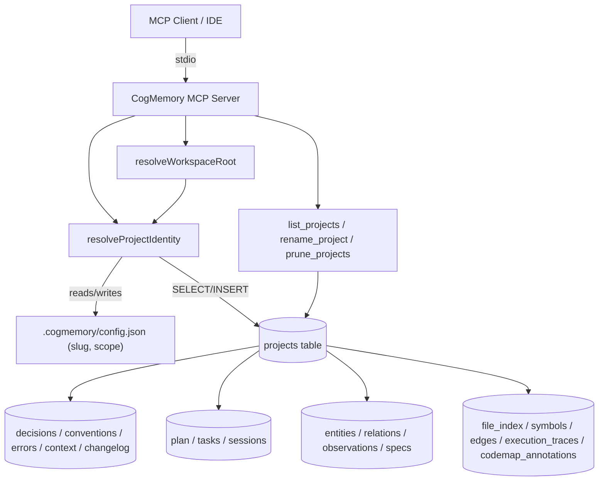

# System Architecture Blueprint: Project Identity & Continuity for CogMemory

CogMemory currently derives project isolation entirely from **filesystem co-location**: a `workspace`-scoped DB lives at `<root>/.cogmemory/memory.db`, and a `global`-scoped DB is a single shared file at `~/.cogmemory/global.db` with **zero in-schema project identifier**. This blueprint introduces a **stable, opaque project slug** as the primary identity key — decoupled from absolute path — so that (a) clients that cannot expand `${workspaceFolder}` and must hard-code a path can still safely multiplex many projects into one database, and (b) folder renames/moves do not sever continuity. It adds a `projects` table, back-fills every memory-bearing table with `project_id`, and defines explicit behavior for slug generation, collision avoidance, git-committed config, forks/copies, multi-root workspaces, and stale-project cleanup.

---

## 1. Software Requirements Specification (SRS)

### Functional Requirements

- FR1: Every write to `decisions`, `conventions`, `errors`, `context`, `changelog`, `plan`, `tasks`, `sessions`, `entities`/`relations`/`observations`, `specs`, and code-graph tables (`file_index`, `symbols`, `edges`, `execution_traces`, `codemap_annotations`) MUST be attributable to exactly one project via `project_id`.
- FR2: A project's identity MUST be a generated opaque slug (UUID v4 or nanoid), stored in `.cogmemory/config.json`, persisted independently of folder path or name.
- FR3: Renaming/moving a project folder MUST NOT break continuity — read/write access to prior memories must continue to work with zero manual intervention (for both `workspace` and `global` scope).
- FR4: The server MUST expose tools to `list_projects`, `rename_project` (label only, not slug), and `prune_projects` (delete-by-slug with confirmation).
- FR5: `cogmemory_status` and `recall`/`list_items`-style queries MUST implicitly scope to the active project unless a cross-project/global query is explicitly requested.
- FR6: Existing DBs (schema v7, no `project_id`) MUST migrate forward without data loss: single-project workspace DBs get one auto-created project row; global DBs get one `legacy-unassigned` project row holding all pre-existing rows.
- FR7: First-run slug bootstrap MUST be race-safe under concurrent process launches against the same fresh folder.

### Non-Functional / SLAs

- NFR1: Migration 008 must run in a single transaction with automatic pre-migration backup (reuse existing `runMigrations` backup-on-v0 pattern, extended to trigger a backup before this migration regardless of starting version, since it's a structural back-fill).
- NFR2: No measurable latency regression on existing single-project workflows (added `WHERE project_id = ?` predicate must hit an index, not a scan).
- NFR3: Slug generation must be collision-resistant (UUID v4 / nanoid(12) ⇒ effectively zero collision probability) — no reliance on folder basename.
- NFR4: All new tools remain read/write via the existing `better-sqlite3` synchronous API; no new runtime dependency beyond a UUID generator (Node's built-in `node:crypto randomUUID()` — zero new dependency).

---

## 2. Architecture Decision Records (ADRs)

### ADR-1: Identity key = opaque slug in `.cogmemory/config.json`, not derived from path or folder name

- Context: Folder basenames collide across unrelated projects (`backend`, `api`); paths break on rename/move; there is currently no in-DB identifier at all.
- Decision: Generate a UUID v4 via `node:crypto.randomUUID()` (built into Node ≥ 22, matches `engines.node` in `package.json`) on first run per project, and persist it as `"project_id"` in `.cogmemory/config.json` alongside the existing `"scope"` key. This value is the sole identity of the project going forward — path is metadata only.
- Consequences: Renaming/moving a folder is now fully safe (path is not part of identity). Config file becomes the single source of truth for identity; losing it (e.g., accidental deletion) is equivalent to "new project" — documented as expected behavior, not a bug.

### ADR-2: One `projects` table + `project_id` FK fan-out across all memory-bearing tables

- Context: Retrofitting isolation into an existing 7-migration schema without breaking existing tools.
- Decision: Add `migrations/008_project_scoping.sql` creating `projects(id, slug, label, root_path_hint, created_at, last_seen_at)` and adding nullable `project_id INTEGER REFERENCES projects(id)` to every memory-bearing table (nullable to keep migration additive/non-breaking; NOT NULL enforced at the application layer for new writes). Existing rows are back-filled to a synthesized project row (see ADR-4).
- Consequences: All existing SQL in `src/tools/*.ts` needs a `project_id` parameter threaded through inserts and an added `AND project_id = ?` filter on selects — a mechanical but wide-reaching change (touches `sessions.ts`, `memory.ts`, `plan-tasks.ts`, `knowledge-graph.ts`, `specs.ts`, `code-graph.ts`, `codemap.ts`, `list-delete.ts`, `code-analysis.ts`, `introspection.ts`).

### ADR-3: Resolve `project_id` once per server process at startup, alongside `resolveWorkspaceRoot`

- Context: `src/config.ts` already resolves `workspaceRoot` and `scope` once at boot (`src/index.ts:22-23`). Project identity should be resolved the same way — once, cheaply, and injected into every tool registrar instead of being re-derived per call.
- Decision: Add `resolveProjectIdentity(workspaceRoot, db): { projectId, slug, isNewProject }` to `src/config.ts`, called immediately after `openDatabase()`. It performs: read `.cogmemory/config.json` → if `project_id` (slug) present, `SELECT id FROM projects WHERE slug = ?`; if absent, `INSERT` new slug atomically (ADR-6) and write it back to config.json. Pass the resulting numeric `projects.id` into every `register*Tools(server, db, projectId, ...)` call in `src/index.ts`.
- Consequences: All tool registrars gain a `projectId: number` parameter; `wrapHandler`/query helpers in `src/tools/utils.ts` gain a shared `withProject(sql)` predicate helper to avoid repeating `AND project_id = ?` everywhere.

### ADR-4: Backward-compatible migration strategy for existing DBs

- Context: v7 DBs already contain rows with no `project_id`. Two cases: workspace-scope (implicitly single-project) vs global-scope (implicitly multi-project, unattributed).
- Decision:
  - Workspace-scope DB: migration 008 auto-creates one `projects` row with `slug = randomUUID()`, `label = basename(workspaceRoot)`, and back-fills `project_id` on all existing rows to that row's id. The generated slug is then written into `.cogmemory/config.json` on next boot (server writes it if missing).
  - Global-scope DB: migration 008 creates a single `projects` row with `slug = 'legacy-unassigned'`, `label = 'Legacy (pre-migration, unattributed)'`, and back-fills all existing rows to it. This is surfaced via `cogmemory_status` and `list_projects` so users can see and optionally triage it later. No attempt is made to auto-split legacy rows — mixing is already lossy and cannot be reconstructed.
- Consequences: Zero data loss; single explicit "legacy" bucket avoids inventing false project boundaries.

### ADR-5: Two-tier identity for team-shared vs. per-clone privacy (git-committed config edge case)

- Context: If `.cogmemory/config.json` is committed to git, every clone/worktree/CI checkout inherits the same slug — sometimes desired (shared team memory), sometimes not (accidental cross-contamination between a dev's 3 local clones).
- Decision: Document `.cogmemory/config.json` as **gitignored by default** (add a note to README + a `.gitignore` suggestion emitted by the server on first run, similar to the existing warning pattern in `tryPath()` at `src/config.ts:98`). If a team explicitly wants shared memory across clones, they opt in by committing the file — no code branching required, just documentation and a first-run advisory log line.
- Consequences: No new schema needed; purely a documentation + first-run UX decision (`console.error` advisory, non-blocking).

### ADR-6: Race-safe first-run slug bootstrap

- Context: Two IDE windows/MCP clients launching simultaneously against a brand-new folder could both attempt to create `.cogmemory/config.json` with different slugs.
- Decision: Use `writeFileSync(path, data, { flag: "wx" })` (exclusive create, fails if exists) to write the generated config atomically. On `EEXIST`, re-read the file that the other process just wrote and adopt its slug instead of failing.
- Consequences: Requires a small retry-read loop in `resolveProjectIdentity`; no external locking library needed (`node:fs` exclusive flag is sufficient for this single-file race).

### ADR-7: Multi-root / nested `.cogmemory/` precedence — nearest wins, explicit override supported

- Context: `findCogmemoryDir()` (`src/config.ts:84-101`) already walks up from CWD to the first `.cogmemory/` found. Monorepos may have nested `.cogmemory/` dirs per package.
- Decision: Keep "nearest-ancestor-wins" as documented behavior (already implemented); no schema change needed. Document explicitly in README that `--workspace`/`COGMEMORY_WORKSPACE` should be used to pin a specific root in monorepos, overriding the walk-up.
- Consequences: Purely a documentation clarification — de-risks a "silent wrong project" surprise without code changes.

### ADR-8: Housekeeping tools for stale/duplicate projects

- Context: Slugs accumulate forever with no cleanup path; forks/copies of a folder (with copied config.json) will collide on the same slug.
- Decision: Add three tools: `list_projects` (id, slug, label, root_path_hint, last_seen_at, row-count summary per project via `cogmemory_status verbose` extension), `rename_project` (updates `label` only — slug is immutable), and `prune_projects` (hard-delete a project and cascade its rows, `confirm: true` required, mirroring `purge_subsystem`'s existing confirm pattern in `src/tools/list-delete.ts`). Additionally, update `last_seen_at` on every server boot for the active project, so `list_projects` can flag candidates for pruning (e.g., not seen in 90+ days).
- Consequences: Gives users a manual escape hatch for collision/fork/staleness scenarios that cannot be fully automated.

### Version Metrics (via Context7 / package.json)

- Node.js engine requirement: `>=22` (`package.json:31`) → `node:crypto.randomUUID()` and `fs.writeFileSync(..., {flag:"wx"})` are both stable, no new dependency required.
- `better-sqlite3@^13.0.3` — synchronous API, transactions via `db.transaction()`, already used in `migration-runner.ts`.
- Current schema version: `MAX_VERSION = 7` in `src/db/migration-runner.ts:12` → next migration is `008_project_scoping.sql`.

---

## 3. System Modeling & Data Boundaries (C4 Context Model)

**Data boundary rule:** every row in every memory-bearing table carries `project_id`. All tool query helpers (`src/tools/utils.ts`) must inject `AND project_id = ?` (or `WHERE project_id = ?` when no other predicate exists) using the process-scoped `projectId` resolved once at boot. Cross-project reads are only possible through the new explicit `list_projects`/admin surface — never through `recall`, `list_items`, or `query_graph`.

**API contract additions:**

- `list_projects()` → `{ id, slug, label, root_path_hint, created_at, last_seen_at, row_counts: {...} }[]`
- `rename_project({ id, label })` → `{ success, message }`
- `prune_projects({ id, confirm: true })` → `{ success, deleted_rows_by_table }`

---

## 4. Infrastructure, Observability & Resilience Blueprint

- **Observability:** extend `cogmemory_status` (`src/tools/introspection.ts`) to report `active_project: { id, slug, label }` and, in verbose mode, per-table row counts scoped to that project — this doubles as a debugging tool for "why do I see other projects' memories" reports.
- **Resilience / failure modes:**
  - Missing `.cogmemory/config.json` on a previously-initialized folder → treated as new project (documented, not an error) per ADR-1 consequence.
  - Corrupt `config.json` → fall back to existing malformed-JSON handling already in `resolveConfig()` (`src/config.ts:31-39`), extended to also regenerate a fresh slug with a stderr warning.
  - `EEXIST` race on first-run write → resolved via read-back per ADR-6.
- **Backup:** migration 008 forces a pre-migration backup regardless of current `user_version` (extending the `current === 0` check in `migration-runner.ts:40` to also fire for this specific structural migration), since it rewrites every table's schema.
- **Rollback:** if migration 008 fails mid-transaction, `db.transaction()` already rolls back atomically (`migration-runner.ts:50-53`); the pre-migration backup file provides a manual restore path.

---

## 5. Implementation Task List (Sprint Breakdown)

Legend: `- [ ] Not Started` | `- [/] In Progress` | `- [x] Completed` | `- [-] Blocked/Cancelled`

### Sprint 1: Schema & Identity Foundation

- [x] Task 1.1: Write `src/db/migrations/008_project_scoping.sql` — create `projects` table (`id, slug UNIQUE, label, root_path_hint, created_at, last_seen_at`), add nullable `project_id` column + index to all memory-bearing tables (`sessions, decisions, conventions, errors, context, changelog, plan, tasks, entities, relations, observations, specs, file_index, symbols, edges, execution_traces, codemap_annotations`).
- [x] Task 1.2: In the same migration, back-fill: workspace-scope DBs get one synthesized project row; global-scope DBs get a `legacy-unassigned` project row; back-fill all existing rows' `project_id` accordingly.
- [x] Task 1.3: Bump `MAX_VERSION` to `8` in `src/db/migration-runner.ts`; force a pre-migration backup for this migration specifically (extend backup condition).
- [x] Task 1.4: Implement `resolveProjectIdentity(workspaceRoot, db)` in `src/config.ts`: read/write `project_id` slug in `.cogmemory/config.json` using `randomUUID()` + exclusive-write race handling (ADR-6); upsert into `projects` table; update `last_seen_at`.
- [x] Task 1.5: Add `context.md`/README notes marking `.cogmemory/config.json` as gitignore-by-default; emit a first-run stderr advisory when the file is created.

### Sprint 2: Tool Layer Fan-Out (project scoping)

- [x] Task 2.1: Add a `withProject(sql, projectId)` / bound-params helper in `src/tools/utils.ts` for consistent `project_id` filtering.
- [x] Task 2.2: Thread `projectId: number` through `registerSessionTools`, `registerMemoryTools`, `registerPlanTasksTools`, `registerKnowledgeGraphTools`, `registerSpecsTools` — update every INSERT to set `project_id` and every SELECT/recall/list query to filter by it.
- [x] Task 2.3: Thread `projectId` through `registerCodeGraphTools`, `registerCodemapTools`, `registerCodeAnalysisTools`, `registerIntrospectionTools`, `registerListDeleteTools` (code-graph tables + `list_items`/`purge_subsystem` scoping).
- [x] Task 2.4: Update `src/index.ts` to call `resolveProjectIdentity` after `openDatabase()` and pass `projectId` into every `register*Tools` call.

### Sprint 3: Project Housekeeping Tools

- [x] Task 3.1: Implement `list_projects` tool (row counts per table, `last_seen_at`, staleness flag e.g. >90 days).
- [x] Task 3.2: Implement `rename_project` tool (label-only update; slug immutable).
- [x] Task 3.3: Implement `prune_projects` tool with `confirm: true` guard and cascade delete, mirroring `purge_subsystem` pattern in `src/tools/list-delete.ts`.
- [x] Task 3.4: Extend `cogmemory_status` to report `active_project` and, in verbose mode, per-project breakdown.

### Sprint 4: Validation & Documentation

- [ ] Task 4.1: Migration test: run against a copy of an existing v7 workspace-scope DB and a v7 global-scope DB fixture; assert row counts unchanged and `project_id` correctly back-filled.
- [ ] Task 4.2: Concurrency test: simulate two processes racing on first-run slug bootstrap in an empty folder; assert both converge on the same slug.
- [ ] Task 4.3: Rename/move test: create a workspace-scope project, write memories, rename the folder, restart server, assert `recall`/`list_items` return prior data unchanged.
- [x] Task 4.4: Update `README.md` — new "Project Identity" section replacing/augmenting the existing "Scope Configuration" and "Workspace Resolution" sections (`README.md:214-241`), documenting slug model, gitignore guidance, and new tools.
- [ ] Task 4.5: Run `pnpm run smoke-test` and `pnpm run build` to confirm no regressions across all touched tool files.
