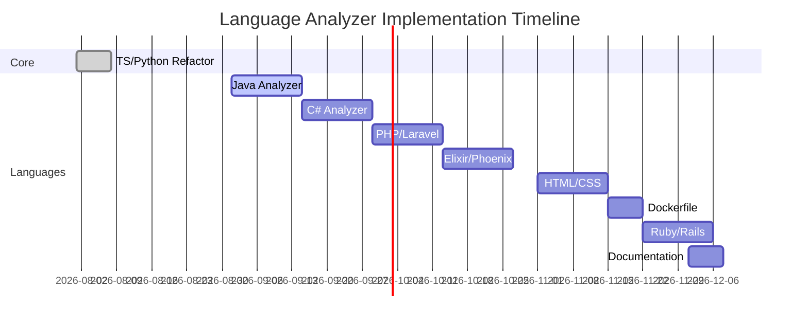

# CogMemory MCP — Unified Architecture Plan

**Last Updated:** 2026-08-26  
**Current Version:** 1.6.4  
**Status:** Core infrastructure complete; multi-language support in progress

---

## 1. Core Infrastructure (Completed ✅)

### Schema Migration & Version Hygiene

- Versioned migrations via `PRAGMA user_version` (7 migrations implemented)
- Auto-generated `src/version.ts` from `package.json`
- Backup system for first-time migrations

### Introspection Tools

- `cogmemory_status`: Runtime configuration reporting
- `check_for_updates`: NPM registry version checks (opt-out supported)

### Code Analysis Tools

- `semantic_code_search` (TF-IDF backend)
- `find_dead_code`/`find_duplicates`/`find_related`
- `query_graph` (multi-hop traversal)
- `analyze_impact` (git diff integration)

### Supported Languages (Current)

- TypeScript/JavaScript (`ts-analyzer.ts`)
- Python (`py-analyzer.ts`)

---

## 2. Language Support (In Progress 🚧)

### Foundation

- `LanguageAnalyzer` interface implemented
- Analyzer registry system operational
- Cross-file edge resolution (ADR-2/3)

### Pending Language Analyzers

| Phase | Language       | Status      | Depends On          |
| ----- | -------------- | ----------- | ------------------- |
| B     | Java           | Not Started | -                   |
| C     | C#             | Not Started | -                   |
| D     | PHP/Laravel    | Not Started | -                   |
| E     | Elixir/Phoenix | Not Started | -                   |
| F     | Erlang         | Not Started | -                   |
| G     | HTML/CSS       | Not Started | -                   |
| H     | Go             | Not Started | -                   |
| I     | Bash           | Not Started | -                   |
| J     | Dockerfile     | Not Started | -                   |
| K     | YAML           | Not Started | -                   |
| L     | HCL/Terraform  | Not Started | -                   |
| M     | C              | Not Started | -                   |
| N     | C++            | Not Started | -                   |
| O     | Rust           | Not Started | -                   |
| P     | Kotlin         | Not Started | -                   |
| Q     | Swift          | Not Started | -                   |
| R     | Ruby/Rails     | Not Started | -                   |
| S     | SQL            | Not Started | -                   |
| T     | Scala          | Not Started | -                   |
| U     | Lua            | Not Started | -                   |
| W     | Documentation  | Not Started | All other languages |

### Key Pending Features

- HTML/CSS `styled-by` linkage (Phase G)
- Framework awareness (Laravel/Phoenix/Rails)
- Extensionless file handling (Dockerfile)

---

## 3. Future Work (Planned 🔮)

### Phase 2 Features

- `sqlite-vec` vector embeddings
- True semantic search (beyond TF-IDF)

### Maintenance

- Go analyzer parity (`is_exported`/`body_hash`)
- Performance optimizations for large repos

---

## Appendix: Task Status Details

### Completed Tasks (From Both Blueprints)

- [x] Schema migration system
- [x] Version constant sourcing
- [x] TS/Python analyzer refactor
- [x] Analyzer registry implementation
- [x] Cross-file edge resolution (ADR-2/3)

### Pending Language Tasks



### Design Decisions Carried Forward

- [ADR-2] Cross-file edge resolution
- [ADR-6] HTML/CSS `styled-by` as post-pass
- [ADR-7] Framework awareness via symbol-type refinement

---

## 5. Tool Surface (MCP Tools)

| Tool                  | Subsystem       | Purpose                                                                                                                                |
| --------------------- | --------------- | -------------------------------------------------------------------------------------------------------------------------------------- |
| `start_session`       | Memory          | Begin a work session                                                                                                                   |
| `end_session`         | Memory          | Close session, store summary                                                                                                           |
| `get_session_summary` | Memory          | Recall what happened in a session                                                                                                      |
| `remember_decision`   | Memory          | Log a decision + rationale                                                                                                             |
| `remember_convention` | Memory          | Log/update a convention (design token, pattern, style, naming)                                                                         |
| `log_error`           | Memory          | Record an error + resolution                                                                                                           |
| `set_active_context`  | Memory          | Upsert current focus/task                                                                                                              |
| `get_active_context`  | Memory          | Read current focus                                                                                                                     |
| `log_change`          | Memory          | Append changelog entry                                                                                                                 |
| `add_plan_item`       | Memory          | Add roadmap item                                                                                                                       |
| `update_plan_status`  | Memory          | Change plan item status                                                                                                                |
| `create_task`         | Memory          | Add actionable task                                                                                                                    |
| `update_task_status`  | Memory          | Change task status                                                                                                                     |
| `recall`              | Memory          | Unified search across decisions/conventions/errors/changelog by tag/text/session                                                       |
| `create_entity`       | Knowledge Graph | Add a node (concept/technology/component/...)                                                                                          |
| `create_relation`     | Knowledge Graph | Link two entities                                                                                                                      |
| `add_observation`     | Knowledge Graph | Attach a fact to an entity                                                                                                             |
| `search_knowledge`    | Knowledge Graph | Query entities/relations/observations                                                                                                  |
| `create_spec`         | Specs           | Store a long-form doc                                                                                                                  |
| `get_spec`            | Specs           | Retrieve a spec by id/title                                                                                                            |
| `update_spec`         | Specs           | Update content, bump version                                                                                                           |
| `index_codebase`      | Code Graph      | Walk workspace, extract symbols + edges via ts-morph                                                                                   |
| `query_code_graph`    | Code Graph      | Point lookup: symbol's callers/callees/imports                                                                                         |
| `generate_codemap`    | Code Graph      | BFS from entry point, N-hop bounded, returns nodes + traces + annotations                                                              |
| `annotate_symbol`     | Code Graph      | Persist narrative text supplied by the calling agent against a symbol or trace (storage-only — server never generates the text itself) |

---

## 6. Design Decisions Log

| Decision                                                        | Rationale                                                                                                   |
| --------------------------------------------------------------- | ----------------------------------------------------------------------------------------------------------- |
| One SQLite file per scope, not 4 separate DBs                   | Enables cross-referencing (e.g. spec → entity, annotation → symbol) without cross-DB joins                  |
| `better-sqlite3` over `sqlite3`                                 | Synchronous API avoids callback/promisify overhead; faster for this access pattern                          |
| Flat tool surface, not namespaced per subsystem                 | Reduces cognitive load for the calling model — no nested API to learn                                       |
| Design tokens/patterns folded into `conventions` via `category` | Same shape (key/value/description), avoids redundant tables                                                 |
| `sessions` as spine with nullable FK on related tables          | Makes "what happened last session" a single indexed query instead of a multi-table join                     |
| Code graph scoped to JS/TS via `ts-morph` first                 | Real static analysis (not regex) is the heaviest lift — ship one language well before expanding             |
| `generate_codemap` bounded by max-hops/max-nodes                | Prevents runaway output on large repos (Cognition's own writeup flags this as a real cost)                  |
| RAG layer dropped                                               | Out of scope per current decision — revisit only if recall quality across large corpora proves insufficient |

---

## 7. Task List

### Phase 0 — Project Setup

- [ ] `npm init`, TypeScript config, `tsup`/`tsc` build setup
- [ ] Install deps: `@modelcontextprotocol/sdk`, `better-sqlite3`, `@types/better-sqlite3`, `zod`, `ts-morph`
- [ ] Set up `.gitignore` (exclude `.cogmemory/` workspace DBs by default)
- [ ] Basic `index.ts` — server bootstrap with no tools, verify it starts under `npx @modelcontextprotocol/inspector`

### Phase 1 — Storage Foundation

- [ ] `config.ts` — scope resolution logic (config file → env var → default)
- [ ] `db/connection.ts` — open DB, set `WAL` + `foreign_keys` pragmas, prepared-statement cache
- [ ] `db/schema.sql` — finalize from provided schema
- [ ] `db/migrate.ts` — apply schema idempotently (`CREATE TABLE IF NOT EXISTS`, run on every startup)
- [ ] Verify: workspace `.cogmemory/memory.db` created correctly; global `~/.cogmemory/global.db` created correctly; scope switching works

### Phase 2 — Memory Tools

- [ ] `sessions`: `start_session`, `end_session`, `get_session_summary`
- [ ] `decisions`: `remember_decision`, include in `recall`
- [ ] `conventions`: `remember_convention` (with category param), include in `recall`
- [ ] `errors`: `log_error`, include in `recall`
- [ ] `context`: `set_active_context`, `get_active_context` (upsert on key)
- [ ] `changelog`: `log_change`, include in `recall`
- [ ] `plan`: `add_plan_item`, `update_plan_status`
- [ ] `tasks`: `create_task`, `update_task_status`
- [ ] `recall`: unified query — filter by tags, text (LIKE), session_id, date range, across decisions/conventions/errors/changelog
- [ ] Zod schemas for every tool input
- [ ] Manual test via MCP Inspector for each tool

### Phase 3 — Knowledge Graph Tools

- [ ] `create_entity` (dedupe on name+type via schema UNIQUE constraint, handle conflict gracefully)
- [ ] `create_relation` (validate both entity IDs exist)
- [ ] `add_observation`
- [ ] `search_knowledge` (by entity name, type, relation type, or observation text)
- [ ] Test via Inspector: build a small graph (e.g. Project → uses → Spring Boot; Project → has-component → Auth Service)

### Phase 4 — Specs Tools

- [ ] `create_spec` (optional `entity_id` link)
- [ ] `get_spec` (by id or title lookup)
- [ ] `update_spec` (version bump, `updated_at` refresh)
- [ ] Test: store a sample PRD-length markdown doc, retrieve it, update it

### Phase 5 — Code Graph: Indexing

- [ ] `indexing/walker.ts` — recursive file discovery respecting `.gitignore` (use `ignore` npm package)
- [ ] `indexing/ts-analyzer.ts` — `ts-morph` Project setup, extract:
  - Symbols: files, functions, classes, interfaces, methods (with line ranges)
  - Edges: function calls, imports, class extends/implements
- [ ] `index_codebase` tool — runs walker + analyzer, upserts into `symbols`/`edges` (handle re-indexing: clear stale entries for changed files, or full re-index — decide based on repo size testing)
- [ ] Test on a real Node/TS project (recommend testing against KanDrop or Audita repo structure)

### Phase 6 — Code Graph: Query & Codemaps

- [ ] `query_code_graph` — given a symbol name/id, return direct callers/callees/imports (1-hop)
- [ ] `generate_codemap` — BFS/DFS from entry symbol, configurable max-hops (default e.g. 3) and max-nodes (default e.g. 50), returns structured node+edge subgraph
- [ ] `execution_traces` support — allow generate_codemap to optionally save a named trace for reuse
- [ ] `annotate_symbol` — attach narrative text to a symbol_id or trace_id (CHECK constraint enforces at least one)
- [ ] Test: generate a codemap for a real feature (e.g. "auth flow") in a test repo, verify hop-bounding works

### Phase 7 — VS Code Integration

- [ ] Write `.vscode/mcp.json` template for consumers:

  ```json
  {
    "servers": {
      "cogmemory": {
        "command": "node",
        "args": ["/absolute/path/to/cogmemory-mcp/dist/index.js"]
      }
    }
  }
  ```

- [ ] Document global vs workspace scope configuration in README
- [ ] Test end-to-end inside VS Code with GitHub Copilot Chat / Claude in VS Code as MCP client
- [ ] Verify workspace-scoped DB is created relative to the correct VS Code workspace root (handle multi-root workspace edge case — document limitation if unresolved)

### Phase 8 — Polish & Packaging

- [ ] Error handling: wrap all tool handlers, return MCP-compliant error responses (never throw raw)
- [ ] Input validation edge cases (empty strings, missing optional FKs)
- [ ] `README.md`: install instructions, tool reference, config reference
- [ ] `package.json` bin entry for `npx cogmemory-mcp` style invocation
- [ ] Decide: publish to npm now or keep local-only for personal use first
- [ ] Basic smoke-test script (`scripts/smoke-test.ts`) that exercises every tool against a temp DB

---

## 8. Open Questions to Resolve Before/During Build

1. **Re-indexing strategy** — full re-index on every `index_codebase` call vs incremental (only changed files)? Recommend: full re-index for Phase 5 (simpler), optimize later if slow on large repos.
2. **Multi-root VS Code workspaces** — which root gets `.cogmemory/`? Recommend: first workspace folder, documented clearly, configurable override via `config.json`.
3. **`recall` ranking** — plain `LIKE` matching is fine for Phase 2; if it proves too weak, SQLite FTS5 virtual tables are a low-cost upgrade later (still no RAG/embeddings needed).
4. ~~Annotation generation~~ — **RESOLVED:** `annotate_symbol` is storage-only. It never calls an LLM itself; it persists narrative text the calling agent passes in as a tool argument. Rationale: no API key/auth surface needed on the server, no redundant re-analysis (the calling agent already has full context from `query_code_graph`/`generate_codemap`), keeps the server fast and dependency-light, and mirrors Codemaps' division of labor (agent annotates, artifact store persists). Flow: agent calls `generate_codemap` → reasons over structure → calls `annotate_symbol(symbol_id, annotation)` with its own text → CogMemory writes it to `codemap_annotations`.

---

## 9. Suggested Build Order

Phase 0 → 1 → 2 (Memory) → 3 (KG) → 4 (Specs) are all straightforward CRUD-over-SQLite and can move fast. Phase 5–6 (Code Graph/Codemaps) is the real engineering effort — budget the most time there. Phase 7 (VS Code wiring) is short but do it early enough (e.g. right after Phase 2) to validate the end-to-end loop works before investing in the harder code-graph phases.
